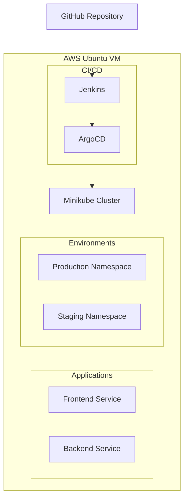

# Infrastructure as Code with Terraform and Ansible

This repository contains automation scripts to deploy and configure an AWS EC2 instance with Minikube, running a web application with ArgoCD, Jenkins, and separate staging/production namespaces.

# Prerequisites

Before you begin, ensure you have the following:
Required Software

Terraform (Install using sudo snap install terraform --classic)
Ansible (Install using sudo apt install ansible)
AWS CLI (Install using sudo apt install awscli2 or sudo snap install aws-cli --classic)
WSL (Windows Subsystem for Linux) if running on Windows

# Required Credentials and Files

AWS Access Key and Secret Key
SSH Key Pair (mykey.pem - not included in repository)
Inventory file (template provided, needs to be configured)
Security group ID in AWS (current: sg-0fe1c471d9c194bd4)

# Initial Setup

Clone this repository:
bashCopygit clone <repository-url>
cd <repository-name>

# Configure AWS credentials:

bashCopyaws configure
Enter your AWS access key, secret key, and preferred region when prompted.
Set up SSH key:

Place your mykey.pem file in the project root directory
Set correct permissions:
bashCopychmod 400 mykey.pem

Create inventory file:
bashCopycp inventory.template inventory
Note: The script will automatically update the inventory file with the new instance IP.

# Usage

Review and modify configurations if needed:

Update security group ID in main.tf if necessary
Adjust instance type or region in main.tf
Modify Ansible playbook (site.yaml) for different configurations

Run the deployment script:
bashCopy./terraform-ansible.sh
This will:

Create EC2 instance using Terraform
Update inventory with new instance IP
Configure the instance using Ansible
Deploy Minikube, ArgoCD, Jenkins, and your web application

