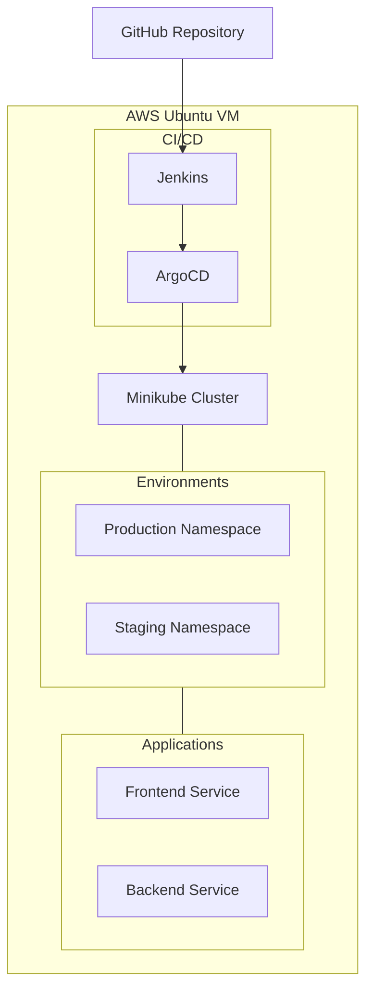
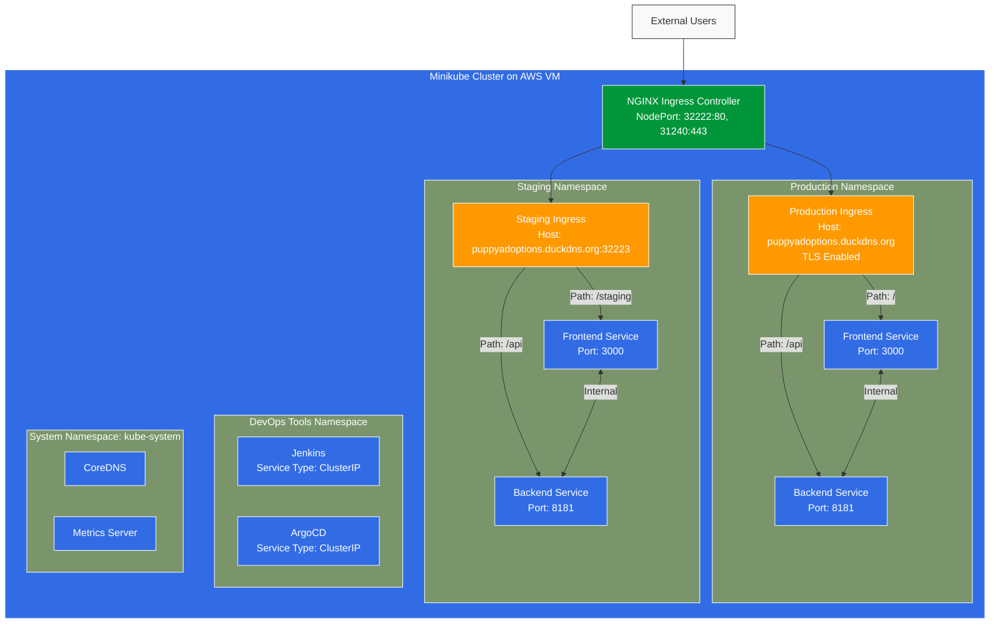

# Namespace Management

kubectl get namespaces

# Check pods in production namespace

kubectl get pods -n production
kubectl describe pods -n production

# Check pods in development namespace

kubectl get pods -n development
kubectl describe pods -n development

# Check pods in ArgoCD namespace

kubectl get pods -n argocd
kubectl describe pods -n argocd

# Check pods in Jenkins namespace

kubectl get pods -n jenkins
kubectl describe pods -n jenkins

# Watch pods across all namespaces

kubectl get pods --all-namespaces -w

# Check pod logs

kubectl logs <pod-name> -n <namespace>
ArgoCD Setup and Access
bashCopy# Install ArgoCD (if not already installed)
kubectl apply -n argocd -f https://raw.githubusercontent.com/argoproj/argo-cd/stable/manifests/install.yaml

# Wait for all ArgoCD pods to be ready

kubectl wait --for=condition=Ready pods --all -n argocd --timeout=300s

# Port forward ArgoCD UI (default port 8080)

kubectl port-forward svc/argocd-server -n argocd 8080:443

# Get initial admin password

kubectl -n argocd get secret argocd-initial-admin-secret -o jsonpath="{.data.password}" | base64 -d
Jenkins Setup and Access
bashCopy# Port forward Jenkins UI (default port 8090)
kubectl port-forward svc/jenkins -n jenkins 8090:8080

# Get Jenkins admin password (if using default Jenkins Helm chart)

kubectl exec -n jenkins <jenkins-pod-name> -- cat /var/jenkins_home/secrets/initialAdminPassword
Additional Useful Commands
bashCopy# Check cluster health
kubectl cluster-info
kubectl get nodes
kubectl top nodes

# Check deployments across namespaces

kubectl get deployments --all-namespaces

# Check services

kubectl get services --all-namespaces

# Check ingress rules

kubectl get ingress --all-namespaces

# View resource usage

kubectl top pods --all-namespaces
kubectl top nodes

# Context and configuration

kubectl config current-context
kubectl config view

# Debugging commands

kubectl describe nodes
kubectl get events --all-namespaces
Port Forwarding Quick Reference
bashCopy# ArgoCD UI
kubectl port-forward svc/argocd-server -n argocd 8080:443

# Jenkins UI

local: kubectl port-forward svc/jenkins-service -n jenkins 8090:8080
for aws: kubectl port-forward svc/jenkins-service -n jenkins 8090:8080 --address 0.0.0.0

# Custom application (example)

kubectl port-forward svc/<service-name> -n <namespace> <local-port>:<service-port>
Cleanup Commands
bashCopy# Stop Minikube
minikube stop

# Delete Minikube cluster

minikube delete

# Delete specific namespace and all its resources

kubectl delete namespace <namespace-name>

kubectl config set-context --current --namespace=jenkins
