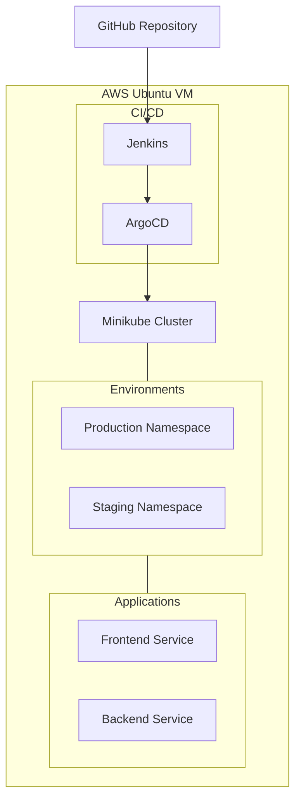

# 🚀 Infrastructure as Code with Terraform and Ansible

> This repository contains automation scripts to deploy and configure an AWS EC2 instance with Minikube, running a web application with ArgoCD, Jenkins, and separate staging/production namespaces.

## ✨ Prerequisites

Before you begin, ensure you have the following:

### 🛠️ Required Software

- Terraform (`sudo snap install terraform --classic`)
- Ansible (`sudo apt install ansible`)
- AWS CLI (`sudo apt install awscli2` or `sudo snap install aws-cli --classic`)
- WSL (Windows Subsystem for Linux) if running on Windows

### 🔑 Required Credentials and Files

- AWS Access Key and Secret Key
- SSH Key Pair (`mykey.pem` - **not included** in repository)
- Inventory file (template provided, needs to be configured)
- Security group ID in AWS (current: `sg-0fe1c471d9c194bd4`)

## 🚦 Initial Setup

1. Clone this repository:
   ```bash
   git clone <repository-url>
   cd <repository-name>
   ```

# AWS Deployment Setup

## Configure AWS Credentials

```bash
aws configure
```

Enter your AWS access key, secret key, and preferred region when prompted.

## Set Up SSH Key

1. Place your `mykey.pem` file in the project root directory.
2. Set correct permissions:
   ```bash
   chmod 400 mykey.pem
   ```

## Create Inventory File

```bash
cp inventory.template inventory
```

**Note:** The script will automatically update the inventory file with the new instance IP.

## Usage

### Review and Modify Configurations if Needed:

- Update security group ID in `main.tf` if necessary.
- Adjust instance type or region in `main.tf`.
- Modify the Ansible playbook (`site.yaml`) for different configurations.

### Run the Deployment Script

```bash
./terraform-ansible.sh
```

This will:

1. Create an EC2 instance using Terraform.
2. Update the inventory with the new instance IP.
3. Configure the instance using Ansible.
4. Deploy Minikube, ArgoCD, Jenkins, and your web application.


